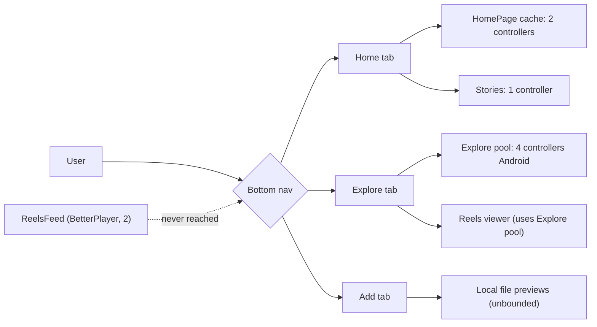
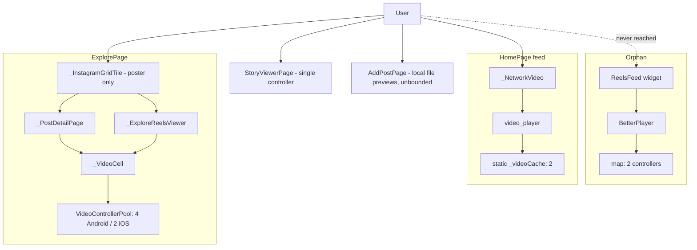
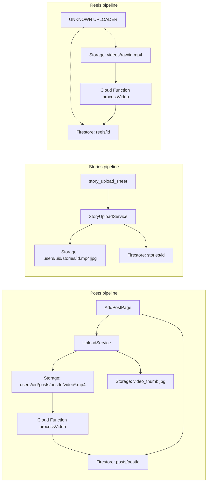
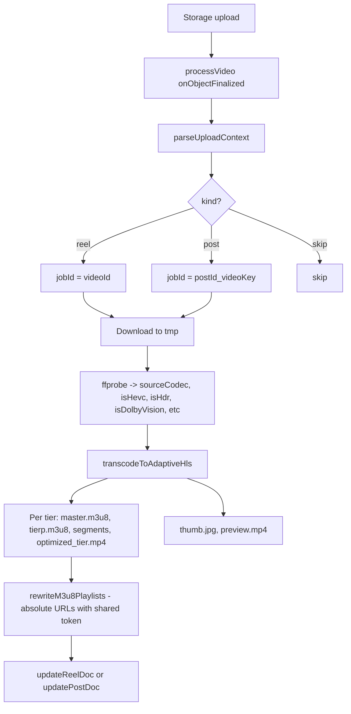
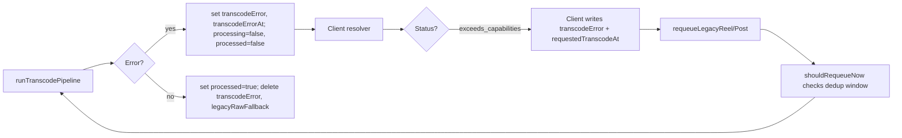
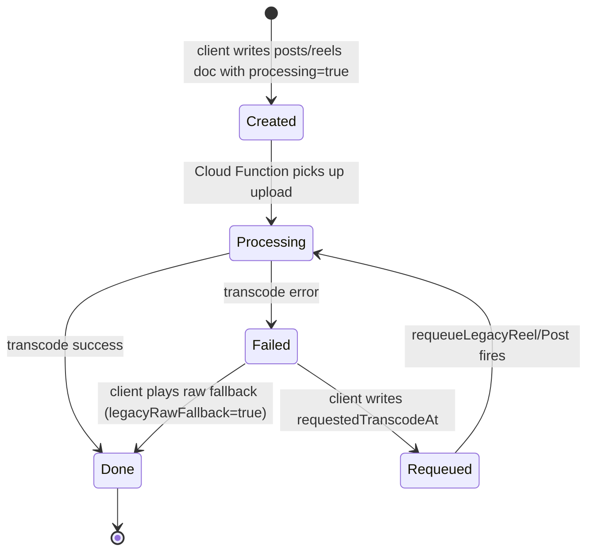
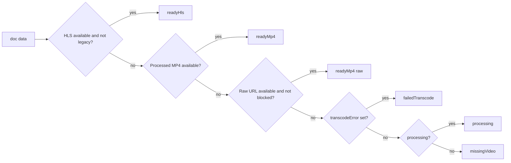
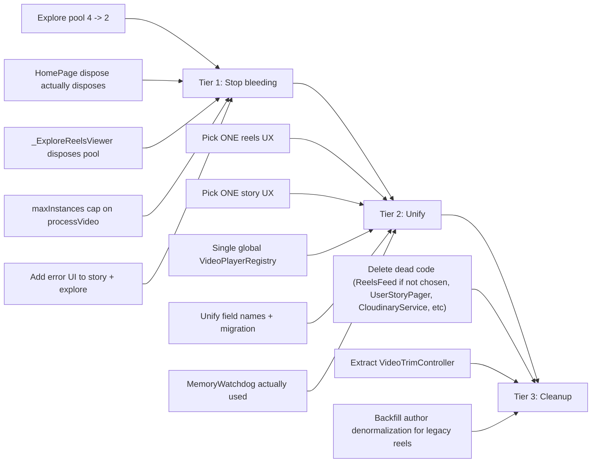

# Halo Video Subsystem — Architecture Audit and Roadmap

> **Status:** Current as of 2026-05-28.
> **Scope:** All video upload, transcoding, playback, and helper-service code in the Halo Flutter app, the `functions/` Cloud Function project, and a brief note on the separate `halo_backend/` Express server.
> **Out of scope:** Auth, chat, profile, wellness, search, posts (text/image-only paths).
> **Companion docs:** [`flutter_reels_feed_review_and_optimization_guide.md`](flutter_reels_feed_review_and_optimization_guide.md) (older, narrower).

## Table of contents

1. [Executive summary](#1-executive-summary)
2. [Component inventory](#2-component-inventory)
3. [Playback paths](#3-playback-paths)
4. [Upload pipeline](#4-upload-pipeline)
5. [Backend (Cloud Functions)](#5-backend-cloud-functions)
6. [Data model](#6-data-model)
7. [Helper services](#7-helper-services)
8. [Issues catalog](#8-issues-catalog)
9. [Improvement roadmap](#9-improvement-roadmap)
10. [Open decisions](#10-open-decisions)

---

## 1. Executive summary

The Halo app has a sophisticated video stack on paper:

- Firebase Storage uploads from `AddPostPage` and `StoryUploadService`.
- A Cloud Function FFmpeg pipeline that produces adaptive HLS, a per-tier MP4, a thumbnail, and a preview clip.
- A reasonably mature URL resolver (`video_playback_resolver.dart`) that classifies playback into six states.
- An OOM-resistant blocked-URL memory persisted across app launches.

In practice, however, the stack has accumulated four to six sessions of half-finished refactors. The visible artefacts:

- **Five separate video playback paths** coexist (Reels, HomePage feed, Explore detail, Explore reels viewer, Story viewer, AddPostPage preview), each with its own controller pool, package choice, and disposal contract.
- **Two complete reels implementations exist in parallel.** One is the new `ReelsFeed` widget in [`lib/reels/reels_feed.dart`](lib/reels/reels_feed.dart) (BetterPlayer, polished over the last four sessions). It is **never instantiated** in navigation. The legacy `_ExploreReelsViewer` inside ExplorePage (`video_player` + a 4-slot controller pool on Android) is what users actually see.
- **Six service classes and one entire alternate UI** are defined with zero production callers.
- **Up to seven simultaneous video decoders** can be alive at once across the three independent pools, exceeding the per-decoder RAM budget on any phone with an Android heap below 512 MB.

### The five most important findings

| # | Finding | File:line | Severity |
|---|---|---|---|
| 1 | `ReelsFeed` widget is never instantiated. Real reels UX is `_ExploreReelsViewer`. | [`lib/reels/reels_feed.dart:29`](lib/reels/reels_feed.dart) (only ref) | Critical |
| 2 | No Flutter code creates `reels/{id}` Firestore docs. Cloud Function expects them present. | [`functions/index.js:975`](functions/index.js) warns `Reel doc missing` | Critical |
| 3 | Explore pool = 4 on Android, while HomePage and Reels are now 2. Imbalance defeats the OOM mitigation. | [`lib/Bottom Pages/ExplorePage.dart:122`](lib/Bottom%20Pages/ExplorePage.dart) | Critical |
| 4 | HomePage `_NetworkVideo.dispose()` does **not** dispose the controller — it pauses and leaves the controller in a static cache. | [`lib/Bottom Pages/HomePage.dart:1983-1991`](lib/Bottom%20Pages/HomePage.dart) | Critical |
| 5 | Three independent pools with no shared registry → the same URL can be decoded twice when both HomePage and Explore are alive. | several | High |

### Quick health snapshot



---

## 2. Component inventory

### 2.1 Flutter Dart files in the video subsystem

| File | Lines (approx) | Role | Status |
|---|---|---|---|
| [`lib/reels/reels_feed.dart`](lib/reels/reels_feed.dart) | 530 | Reels feed (BetterPlayer, 2-slot cache) | **Orphan** — never instantiated |
| [`lib/Bottom Pages/HomePage.dart`](lib/Bottom%20Pages/HomePage.dart) (lines 1771–2058) | 2722 total | Feed posts + `_NetworkVideo` widget | Active |
| [`lib/Bottom Pages/ExplorePage.dart`](lib/Bottom%20Pages/ExplorePage.dart) | ~4000 | Grid + detail + reels viewer + `VideoControllerPool` | Active |
| [`lib/Bottom Pages/AddPostPage.dart`](lib/Bottom%20Pages/AddPostPage.dart) | 1900 | Upload UI + local-file previews | Active |
| [`lib/Bottom Pages/video_quick_edit_page.dart`](lib/Bottom%20Pages/video_quick_edit_page.dart) | – | Trim UI preview | Active |
| [`lib/Bottom Pages/video_thumbnail_picker.dart`](lib/Bottom%20Pages/video_thumbnail_picker.dart) | – | Frame picker preview | Active |
| [`lib/story/story_viewer_page.dart`](lib/story/story_viewer_page.dart) | ~280 | Story playback (`video_player`) | Active |
| [`lib/story/user_story_pager.dart`](lib/story/user_story_pager.dart) | ~140 | Alternate story UI (`story_view` pkg) | **Dead** — no callers |
| [`lib/services/reel_service.dart`](lib/services/reel_service.dart) | 74 | Firestore stream for reels | Active |
| [`lib/services/feed_service.dart`](lib/services/feed_service.dart) | ~280 | Posts feed queries (metadata only) | Active |
| [`lib/services/post_service.dart`](lib/services/post_service.dart) | ~30 | Image upload only (no video) | Active |
| [`lib/services/explore_service.dart`](lib/services/explore_service.dart) | ~120 | Explore ranking queries | Active |
| [`lib/services/upload_service.dart`](lib/services/upload_service.dart) | ~280 | Storage uploads for posts | Active |
| [`lib/services/story_upload_service.dart`](lib/services/story_upload_service.dart) | ~100 | Story uploads (already denormalizes author) | Active |
| [`lib/services/cloudinary_service.dart`](lib/services/cloudinary_service.dart) | ~25 | Cloudinary client wrapper | **Dead** — never imported elsewhere in `lib/` |
| [`lib/services/reel_player_lifecycle.dart`](lib/services/reel_player_lifecycle.dart) | 145 | `ReelPlatformPolicy` + lifecycle logging | Partially active (see 2.2) |
| [`lib/services/memory_watchdog.dart`](lib/services/memory_watchdog.dart) | 100 | RSS pressure monitor | **Defined but unused** — nobody calls `start()` |
| [`lib/services/video_playback_resolver.dart`](lib/services/video_playback_resolver.dart) | ~550 | URL resolution + state classification | Active |
| [`lib/services/blocked_url_memory.dart`](lib/services/blocked_url_memory.dart) | ~100 | Persistent block-list for OOM URLs | Active |
| [`lib/services/app_cache_manager.dart`](lib/services/app_cache_manager.dart) | ~10 | Image-only `flutter_cache_manager` | Active |

### 2.2 Symbol-level status inside `reel_player_lifecycle.dart`

| Symbol | Status | Notes |
|---|---|---|
| `ReelPlatformPolicy` | Active | Used by `reels_feed.dart`, `HomePage.dart` (line 1794), `ExplorePage.dart` (line 122 for `isIOS` only) |
| `ReelLifecycleLog` | Active (partial) | `bind`, `dispose`, `activate`, `deactivate`, `playerException`, `generationMismatch`, `memoryPressure` all have callers. `unbind`, `fallbackStart`, `fallbackSuccess`, `firstFrameRendered` have **zero callers**. |
| `ReelPlaybackFallbackTracker` | **Dead** | Never instantiated anywhere; only referenced in `PHASE4_LIFECYCLE.md` |
| `ReelBindGeneration` | **Dead** | `_VideoCellState` uses a raw `int _bindGeneration` instead of this helper |

### 2.3 Cloud Function exports (`functions/index.js`, 1714 lines total)

| Export | Trigger | Lines | Status |
|---|---|---|---|
| `processVideo` | Storage v2 `onObjectFinalized` | 1373–1408 | Active |
| `requeueLegacyReel` | Firestore v2 `onDocumentWritten` on `reels/{reelId}` | 1637–1652 | Active |
| `requeueLegacyPost` | Firestore v2 `onDocumentWritten` on `posts/{postId}` | 1654–1669 | Active |
| `migrateLegacyVideos` | HTTPS v2 `onCall` | 1739–1767 | Active |

### 2.4 `halo_backend/` Express server

**Verdict: unrelated to video.** This is a parallel REST layer for users, text-only posts, and Cloudinary image upload. It has no video endpoints. It can be ignored for the video audit but is documented here so future readers don't waste time re-investigating.

| File | Role |
|---|---|
| `halo_backend/server.js` | Express entry — `/upload` (Cloudinary image upload), `/users`, `/posts`, `/test-cloudinary`, health check on `/` |
| `halo_backend/controllers/postController.js` | Accepts `text` + `imageUrl` only |
| `halo_backend/controllers/userController.js` | User CRUD |
| `halo_backend/routes/*.js` | Express routes |
| `halo_backend/config/firebaseConfig.js` | Firebase Admin init |
| `halo_backend/serviceAccountKey.json` | Service-account credentials |
| `halo_backend/.env` | `PORT=5000`, Cloudinary keys |

---

## 3. Playback paths

The app has **five distinct video playback paths** plus an orphan sixth. Each path owns its lifecycle independently. The biggest architectural smell here is that no central registry exists — playing the same URL in HomePage and Explore creates two simultaneous decoders.

### 3.1 High-level map



### 3.2 Comparison table

| Path | Package | Pool size (Android / iOS) | Disposal | Visibility threshold |
|---|---|---|---|---|
| **Reels feed** (orphan) | `better_player` | 2 / 2 | `dispose()` on widget + memory pressure | `< 0.5` pause |
| **HomePage feed** | `video_player` | 2 / 2 (static cache) | Widget dispose **pauses** only; LRU eviction disposes | `> 0.6` init+play |
| **Explore grid** | none | 0 / 0 | N/A — poster image | N/A |
| **Explore detail** | `video_player` via pool | 4 / 2 | `release()` pauses; `_remove` LRU disposes | `> 0.05` |
| **Explore reels viewer** | `video_player` via pool | 4 / 2 | Same as detail; only current page mounts cell | Same as detail |
| **Story viewer** | `video_player` | 1 / 1 | `dispose()` on story change + page dispose | None |
| **AddPostPage preview** | `video_player` (local file) | Unbounded per page | Per page dispose | None |

### 3.3 Reels feed (orphan — [`lib/reels/reels_feed.dart`](lib/reels/reels_feed.dart))

Recently optimized across four sessions:

- BetterPlayer (ExoPlayer / AVPlayer) — handles MP4, WebM, MOV, MKV, HLS, DASH natively.
- 200 MB disk cache, 3–8 s buffer window, 10 MB pre-cache per reel.
- Controller cache bounded to `ReelPlatformPolicy.maxPoolSlots` (2) via `_syncControllers` + `warmIndices(center, center+1)` ([line 197](lib/reels/reels_feed.dart), [line 281](lib/reels/reels_feed.dart)).
- `WidgetsBindingObserver` + `didHaveMemoryPressure()` + `VisibilityDetector` triple-redundant pause logic.
- Phase 6 author denormalization: reads `username`/`profilePic` from the reel doc first, only falls back to a per-reel Firestore lookup for legacy docs.

**The catch:** no other Dart file imports or navigates to `ReelsFeed`. The only reference is the constructor declaration itself. The widget is dead code at runtime.

### 3.4 HomePage `_NetworkVideo` ([`lib/Bottom Pages/HomePage.dart:1771–2058`](lib/Bottom%20Pages/HomePage.dart))

- Package: `video_player`.
- Static `LinkedHashMap<String, VideoPlayerController> _videoCache` keyed by trimmed URL (line 1794).
- `_maxCachedControllers = ReelPlatformPolicy.maxPoolSlots` (2 on all platforms after Stage 2A).
- Init: `VisibilityDetector` (`> 0.6` for 220 ms debounce) → `_initIfNeeded` → cache lookup or `VideoPlayerController.networkUrl` → eviction → trim listener.
- **Critical disposal bug:** `dispose()` at line 1983 cancels the debounce, bumps generation, logs disposal, and calls `_pauseAndHide()` — but **does not remove the controller from the static cache** or call `controller.dispose()`. The controller lingers until the LRU eviction kicks it out when a new URL is bound. While idle in the cache it still holds a decoder surface and buffers.
- `_initGeneration` (line 1806) protects against stale async completions.
- Trim logic (`_updateTrimBounds`, `_enforceTrimWindow`) is duplicated almost identically in Explore's `_VideoCell`.
- Unused `fallbackUrl` prop is passed in but never consulted by state logic.

### 3.5 Explore `VideoControllerPool` ([`lib/Bottom Pages/ExplorePage.dart:118–287`](lib/Bottom%20Pages/ExplorePage.dart))

The largest pool in the app:

| Aspect | Detail |
|---|---|
| Singleton | Yes (`VideoControllerPool.instance`, line 120) |
| Max size | `ReelPlatformPolicy.isIOS ? 2 : 4` — **4 on Android** (line 122) |
| Public API | `preload`, `get`, `getOrPreload`, `release`, `isReady`, `disposeAll` |
| `release()` | Pauses + mutes; entry **stays** in pool (lines 274–280) |
| `disposeAll()` | **Never called anywhere in the repo** (lines 282–286) |
| Eviction | LRU first-in evicted when new entry pushes size to limit (lines 252–257) |
| Block check | Consults `BlockedUrlMemory.contains(url)` before preload (lines 135) |

The `_VideoCell` widget ([lines 3287–3846](lib/Bottom%20Pages/ExplorePage.dart)) is the actual renderer:

- Bind generation tracked as raw `int _bindGeneration` (line 3333).
- Errors from `c.value.hasError` trigger `_recordCapabilityFailure` + add to `BlockedUrlMemory` and write a `transcodeError: 'exceeds_capabilities'` flag back to Firestore via `_writeBackendRequeueFlag` (line 3565).
- `dispose()` calls `release()` only, not `_remove` — so controllers leak into the pool and survive route changes.

### 3.6 Explore `_ExploreReelsViewer` ([`lib/Bottom Pages/ExplorePage.dart:2639+`](lib/Bottom%20Pages/ExplorePage.dart))

**This is the in-app "reels" experience users actually see today.**

- Opened from `_InstagramGridTile.onTap` → `_onTileTap` → `_openReels(videoPosts, startIdx)` (lines 996–1027).
- Vertical `PageView` of `_ReelItem`s. `_VideoCell` is mounted only when `widget.isCurrent` — adjacent pages show poster images only.
- `ReelPrefetchManager.prefetchAround` is called on init and page-change (lines 2661–2715), but **adjacent pages don't render the cell**, so prefetch consumes pool slots without an active widget binding.
- `dispose()` on the viewer only disposes the `PageController` (lines 2673–2676) — no pool teardown, no prefetch cancellation. Controllers persist when the user backs out.

### 3.7 Story viewer ([`lib/story/story_viewer_page.dart`](lib/story/story_viewer_page.dart))

- Single `VideoPlayerController` per active story (line ~54).
- No try/catch around `initialize()` — a failure leaves the screen in an indeterminate state.
- Non-current pages in the story `PageView` fall back to `Image.network(story.mediaUrl)` even when `mediaType == 'video'` (line ~235), so a still frame is shown until the page becomes active.
- Alternate `UserStoryPager` ([`lib/story/user_story_pager.dart`](lib/story/user_story_pager.dart)) uses the `story_view` package; **not wired into navigation**.

### 3.8 AddPostPage previews ([`lib/Bottom Pages/AddPostPage.dart`](lib/Bottom%20Pages/AddPostPage.dart))

Three preview surfaces:

| Surface | Controller pattern |
|---|---|
| Composer strip | None — icon placeholder for videos (lines 1413–1435) |
| `_MediaViewerPage` (tap-expand) | One `VideoPlayerController.file` per visible page (`_VideoViewerItem`, lines 1547–1636) |
| `_PostPreviewPage` (share preview) | Lazy `VideoPlayerController.file` per carousel index; previous index disposed on page change (lines 1684–1864) |

The `MediaItem.videoController` field (line 37) is declared and disposed in three places (lines 124, 358, 644) but **never assigned**, suggesting a refactor abandoned mid-way.

---

## 4. Upload pipeline

### 4.1 Map



### 4.2 Posts pipeline ([`AddPostPage._submitPost`](lib/Bottom%20Pages/AddPostPage.dart) lines 489–641)

- Up to 4 media items per post (line 62).
- Video constraints: 3 min cap (lines 218–220), optional trim/cover via `VideoQuickEditPage`.
- Uploads run **sequentially** (lines 535–589). Failure mid-loop leaves Storage orphans without a Firestore post doc.
- After all uploads, `posts/{postId}.set(...)` writes the document (lines 598–624).
- Top-level `videoUrl` is filled from `uploaded['videoUrl']` but `UploadService.uploadVideoWithThumbnail` **always returns `videoUrl: ''`** (see [`lib/services/upload_service.dart`](lib/services/upload_service.dart) line ~167), so the field is usually empty at create time — the Cloud Function backfills it after transcoding.
- `users/{uid}.update({postsCount: increment(1)})` afterwards (lines 626–629).

### 4.3 Stories pipeline ([`StoryUploadService.pickAndUploadStory`](lib/services/story_upload_service.dart))

- Single-asset only (image OR video, no carousels).
- Video cap: 30 s (lines 23–33).
- Storage path: `users/{uid}/stories/{storyId}.mp4` or `.jpg`.
- Firestore `stories/{id}.set(...)` writes:
  ```
  id, userId, username, userPhotoUrl, mediaUrl, mediaType,
  createdAt, expiresAt (+24h), viewers: []
  ```
- **Already denormalizes author** (`username` from `username/name/full_name/business_name`; `userPhotoUrl` from `profilePhoto`). This is the only collection that gets author denormalization at upload time today.
- No Cloud Function step — stories play the raw upload URL directly.

### 4.4 Reels pipeline — **missing client side**

The Cloud Function ([`functions/index.js:120–132`](functions/index.js)) recognises uploads at `videos/raw/{id}.mp4|mov|m4v|webm` as reel jobs. `updateReelDoc` (line 972) expects `reels/{videoId}` to already exist and logs `Reel doc missing` if not. **No Dart code writes to that Storage path or creates a `reels` document.**

Possibilities:
- Manually uploaded test data.
- An older client (web admin?) that was removed.
- Planned work — `lib/reels/reels_feed.dart` has a `TODO(stage4)` referencing server-side transcoding.

Either way, this is the most important architectural question to answer before further reels work.

### 4.5 Storage path glossary

| Path | Producer |
|---|---|
| `users/{uid}/posts/{postId}.jpg` | `UploadService.uploadPostImage` (legacy) |
| `users/{uid}/posts/{postId}/{thumb\|medium\|full}[_{i}].webp` | `UploadService.uploadAdaptivePostImage` |
| `users/{uid}/posts/{postId}/video[_{i}].mp4` | `UploadService.uploadVideoWithThumbnail` |
| `users/{uid}/posts/{postId}/video_thumb[_{i}].jpg` | same |
| `users/{uid}/stories/{storyId}.{mp4\|jpg}` | `StoryUploadService` |
| `users/{uid}/profile_{timestamp}.jpg` | `UploadService.uploadProfileImage` (unused caller) |
| `videos/raw/{id}.mp4` | **Unknown** — referenced only by resolver + Cloud Function |
| `videos/processed/{reelId}/...` | Cloud Function output |
| `videos/processed/posts/{postId}/{videoKey}/...` | Cloud Function output |
| `profile_pics/{uid}.jpg`, `posts/{ts}`, `users/{uid}/gallery/...`, `users/{uid}/products/...`, `users/{uid}/events/...` | Profile / wellness section uploads (not video) |

---

## 5. Backend (Cloud Functions)

### 5.1 Triggers

| Export | Trigger | Memory | Timeout | CPU | maxInstances |
|---|---|---|---|---|---|
| `processVideo` | Storage `onObjectFinalized` | 2 GiB | 540 s | 2 | **not set** |
| `requeueLegacyReel` | Firestore `onDocumentWritten` on `reels/{id}` | 2 GiB | 540 s | 2 | **not set** |
| `requeueLegacyPost` | Firestore `onDocumentWritten` on `posts/{id}` | 2 GiB | 540 s | 2 | **not set** |
| `migrateLegacyVideos` | HTTPS `onCall` | 512 MiB | 540 s | default | **not set** |

The missing `maxInstances` cap is a real cost concern — a sudden burst of uploads (or a rogue `requeue` loop) can fan out to many parallel 2 CPU / 2 GiB / 9-minute FFmpeg jobs.

### 5.2 Transcoding pipeline (`runTranscodePipeline`, lines 1189–1371)



- `TIER_KEYS` is `['1080','720','480','360']` (line 24).
- `videoUrl` is set to the 720p MP4 (with 1080/480 fallback if 720 fails).
- `hlsUrl` is the rewritten `master.m3u8`.
- Phase 6 author patch (`buildAuthorPatch`, added in our last session) merges `username`/`displayName`/`profilePic` into the reel doc — **only if those fields aren't already there**, so user renames don't retroactively rewrite old reels.

### 5.3 Failure flow



- `legacyRawFallback: true` is set by the resolver when playing a raw URL because no processed assets exist yet ([resolver line 444, 468](lib/services/video_playback_resolver.dart)).
- The Cloud Function deletes it on successful transcode.
- `requestedTranscodeAt` is checked in `shouldRequeueNow` (lines 1468–1472). A 15-minute dedup window prevents tight loops unless a prior `transcodeError` exists.

### 5.4 Source probing

`buildSourceMetadataPatch(probe)` (lines 957–970) writes:

- `sourceCodec`, `sourceWidth`, `sourceHeight`, `sourceFps`, `sourceDurationSec`
- `sourceIsHdr`, `sourceIsHevc`, `sourceIsDolbyVision`, `sourceOrientation`

These fields are then consumed by the client resolver to decide whether raw playback is safe (`allowsRawPlayback` in [`video_playback_resolver.dart`](lib/services/video_playback_resolver.dart) lines 172–180) — the same metadata that's silently used to drive the OOM-blocking logic.

---

## 6. Data model

### 6.1 Field-name dialects per collection

| Concept | `posts` doc | `posts.media[]` item | `reels` doc | `stories` doc |
|---|---|---|---|---|
| Author UID | `userId` | – | `userId` (assumed) | `userId` |
| Primary video URL | `videoUrl` (often empty until transcode) | `videoUrl`, `url`, `rawVideoUrl` | `videoUrl` | `mediaUrl` |
| HLS master | – | – | `hlsUrl` | – |
| Quality variants | – | – | `qualities: {720: url, ...}` | – |
| Preview clip | – | – | `previewUrl` | – |
| Thumbnail | `thumbnailUrl`, `imageUrl` (legacy) | `thumbnail`, `thumbnailUrl` | `thumbnailUrl` | – |
| Type tag | `isVideo`, `hasMedia` | `type: 'video'` | (implicit) | `mediaType` |
| Processing | `processing`, `processed` | `processing`, `processed` | `processing`, `processed` | – |
| Failure | `transcodeError` (server-set) | `transcodeError` | `transcodeError`, `transcodeErrorAt` | – |
| Raw fallback flag | `legacyRawFallback` | `legacyRawFallback` | `legacyRawFallback` | – |
| Manual requeue | `requestedTranscodeAt`, `requeuedAt` | – | `requestedTranscodeAt`, `requeuedAt` | – |
| Source meta | (denormalized into media item by CF) | `sourceWidth/Height/Fps/Codec/IsHevc/IsHdr/IsDolbyVision/Orientation` | same | – |
| Author denormalization | **none** | – | `username`, `displayName`, `profilePic` (Phase 6) | `username`, `userPhotoUrl` (from start) |
| Counts | `likeCount`, `commentCount` | – | `views`, `likes`, `comments`, `shares`, `completedViews`, `replayCount`, `totalWatchTime`, `durationSeconds` | `viewers: []` |

### 6.2 URL field dialect chaos

The resolver (`video_playback_resolver.dart`) silently smooths over **five different ways a video URL might be stored** on a single document:

- `videoUrl` (canonical post field)
- `url` (carousel media item field)
- `mediaUrl` (story field; resolver also checks it as last resort on posts)
- `rawVideoUrl` (transitional field used while transcoding)
- `video_url` (snake_case, accepted by `reels_feed.dart` fallback chain)

The reels feed and the resolver each maintain their own ordered fallback chain. They are not identical:

| Source | Order |
|---|---|
| `reels_feed.dart` | `videoUrl` → `video_url` → `url` → `mediaUrl` |
| `video_playback_resolver.dart` `pickProcessedMp4` | `qualities['720']` → `qualities['480']` → `qualities['1080']` → `videoUrl` → `url` |
| `video_playback_resolver.dart` `pickRawFallback` | `rawVideoUrl` → `videoUrl` → `url` |

### 6.3 Processing state machine



### 6.4 Author denormalization status

| Collection | Denormalized? | Where written | Notes |
|---|---|---|---|
| `stories` | Yes | `StoryUploadService` (lines 70–80) — `username`, `userPhotoUrl` | Has worked since the original implementation |
| `reels` | Yes (since Phase 6) | `functions/index.js buildAuthorPatch` — `username`, `displayName`, `profilePic`, only writes missing fields | New reels only; legacy reels still take the FutureBuilder path in `reels_feed.dart` |
| `posts` | **No** | – | HomePage still relies on the user UID and `_userCache` (separate from video subsystem) |

---

## 7. Helper services

### 7.1 Status table

| Service | Purpose | Production callers | Notes |
|---|---|---|---|
| [`reel_service.dart`](lib/services/reel_service.dart) | Stream + rank reels | `reels_feed.dart` (orphan) | Effectively dead until reels feed is wired |
| [`feed_service.dart`](lib/services/feed_service.dart) | Stream + rank posts | `HomePage.dart` | Healthy |
| [`post_service.dart`](lib/services/post_service.dart) | Image upload helper | unused in video context | – |
| [`explore_service.dart`](lib/services/explore_service.dart) | Explore ranking | `ExplorePage.dart` | Healthy |
| [`upload_service.dart`](lib/services/upload_service.dart) | Storage uploads for posts | `AddPostPage.dart` | `uploadProfileImage` never called |
| [`story_upload_service.dart`](lib/services/story_upload_service.dart) | Story upload | `story_upload_sheet.dart` | Healthy |
| [`cloudinary_service.dart`](lib/services/cloudinary_service.dart) | Cloudinary client | **none** | Dead in Flutter; Cloudinary actually used in `halo_backend/server.js` |
| [`reel_player_lifecycle.dart`](lib/services/reel_player_lifecycle.dart) | Policy + logs | `reels_feed.dart`, `HomePage.dart`, `ExplorePage.dart` | Mixed — see 2.2 |
| [`memory_watchdog.dart`](lib/services/memory_watchdog.dart) | RSS poller (180/220/240 MB thresholds) | **none** | `start()` never called |
| [`video_playback_resolver.dart`](lib/services/video_playback_resolver.dart) | URL classification, raw-block decision | `HomePage.dart`, `ExplorePage.dart` | The resolver is the only piece of cross-path consistency |
| [`blocked_url_memory.dart`](lib/services/blocked_url_memory.dart) | Persistent block-list | `main.dart` init, resolver, ExplorePage | Healthy; 256-entry FIFO, persists in `SharedPreferences` |
| [`app_cache_manager.dart`](lib/services/app_cache_manager.dart) | Image cache manager | HomePage, ExplorePage | Images only; videos use BetterPlayer's own cache or none |

### 7.2 Resolver chain (key reading)

The resolver returns a `ResolvedVideoPlayback` with one of six `ReelStatus` values:



`pickRawFallback` blocks raw playback when:

- `BlockedUrlMemory.contains(url)` (a prior decoder failure was recorded), or
- `VideoSourceMetadata.allowsRawPlayback` is false (exceeds 1920 wide or 31 fps), or
- `_hasExoticCodecHints` (HEVC / HDR / Dolby Vision flags), or
- `uploadServiceBlocked` (still processing with empty URLs but a raw URL exists).

### 7.3 Defined-but-unused entry points

These should be deleted, wired in, or moved to a `notes/` archive — they're noise in IDE auto-imports today:

| Symbol | File |
|---|---|
| `ReelPlaybackFallbackTracker` class | `reel_player_lifecycle.dart` |
| `ReelBindGeneration` class | `reel_player_lifecycle.dart` |
| `ReelLifecycleLog.unbind` | `reel_player_lifecycle.dart:44` |
| `ReelLifecycleLog.fallbackStart` | `reel_player_lifecycle.dart:70` |
| `ReelLifecycleLog.fallbackSuccess` | `reel_player_lifecycle.dart:76` |
| `ReelLifecycleLog.firstFrameRendered` | `reel_player_lifecycle.dart:86` |
| `MemoryWatchdog` (entire class) | `memory_watchdog.dart` |
| `CloudinaryService` (entire class) | `cloudinary_service.dart` |
| `UserStoryPager` (entire widget) | `lib/story/user_story_pager.dart` |
| `ReelsFeed`, `_ReelPage`, `_ReelVideoPlayer`, `_AuthorRow`, `_Avatar` | `lib/reels/reels_feed.dart` |
| `MediaItem.videoController` (field — declared, disposed, never assigned) | `AddPostPage.dart:37` |
| `UploadService.uploadProfileImage` | `upload_service.dart` |

---

## 8. Issues catalog

Tags: **C** = Critical · **B** = Bug · **D** = Dead code · **P** = Performance · **U** = UX · **I** = Inconsistency.

| # | Tag | Symptom | File:line | Suggested fix (one line) |
|---|---|---|---|---|
| 1 | C | Explore pool = 4 on Android; allows 4 simultaneous high-res decoders | [`ExplorePage.dart:122`](lib/Bottom%20Pages/ExplorePage.dart) | Replace `ReelPlatformPolicy.isIOS ? 2 : 4` with `ReelPlatformPolicy.maxPoolSlots` (i.e. always 2) |
| 2 | C | HomePage `_NetworkVideo.dispose()` does not dispose controller — pause only | [`HomePage.dart:1983-1991`](lib/Bottom%20Pages/HomePage.dart) | Either dispose in widget `dispose()`, or actively evict from `_videoCache` when not in `_visibleKeys` |
| 3 | C | `_ExploreReelsViewer.dispose()` only disposes `PageController`; pool entries leak across route | [`ExplorePage.dart:2673-2676`](lib/Bottom%20Pages/ExplorePage.dart) | Call `VideoControllerPool.instance.disposeAll()` (or per-URL release+remove) on viewer dispose |
| 4 | C | `VideoControllerPool.disposeAll()` defined but never called | [`ExplorePage.dart:282-286`](lib/Bottom%20Pages/ExplorePage.dart) | Call from `_ExploreReelsViewer.dispose` and on tab change |
| 5 | C | No client-side video resolution capping; 4K HEVC decodes at full resolution everywhere | all playback paths | Switch to `better_player` (supports `setTrackParameters` in newer fork) **or** rely on server-side transcode (Tier 1 below) |
| 6 | C | Three independent pools, no shared registry; same URL can decode twice if Home + Explore are alive | various | Introduce a single global `VideoPlayerRegistry` keyed by canonical URL |
| 7 | B | `ReelsFeed` widget exists but is never instantiated; recent optimization work is dormant | [`reels_feed.dart:29`](lib/reels/reels_feed.dart) | Either wire into a bottom-tab route, or delete (see open decision 10.1) |
| 8 | B | No Flutter code creates `reels/{id}` Firestore docs; Cloud Function logs `Reel doc missing` | [`functions/index.js:975`](functions/index.js) | Add a reel-creation flow in `AddPostPage` (separate "post as reel" UI), or repurpose posts→reels in the Cloud Function |
| 9 | B | `_NetworkVideo.fallbackUrl` prop passed but never read | [`HomePage.dart:1781, 1747`](lib/Bottom%20Pages/HomePage.dart) | Use it for HLS→MP4 fallback in init or remove the prop |
| 10 | B | `MediaItem.videoController` declared and disposed but never assigned | [`AddPostPage.dart:37, 124, 358, 644`](lib/Bottom%20Pages/AddPostPage.dart) | Either populate it during preview wiring or remove the dead field |
| 11 | B | `StoryViewerPage._loadStory` has no try/catch around `initialize()` — failure leaves UI broken | [`story_viewer_page.dart:54-79`](lib/story/story_viewer_page.dart) | Wrap in try/catch + show error state with retry |
| 12 | B | Non-current story `PageView` pages render `Image.network(mediaUrl)` even when `mediaType == 'video'` | [`story_viewer_page.dart:235-236`](lib/story/story_viewer_page.dart) | Use the stored thumbnail (add one to the story doc) instead of the video URL |
| 13 | B | `_ReelItem` only mounts `_VideoCell` for `isCurrent`, but `ReelPrefetchManager` preloads 2 ahead | [`ExplorePage.dart:2720-2732, 2832`](lib/Bottom%20Pages/ExplorePage.dart) | Either render the cell for prefetched indices, or stop prefetching what won't be used |
| 14 | B | `requeueLegacyReel`/`requeueLegacyPost` fire on every doc write, not just transcode-error writes | [`functions/index.js:1637-1669`](functions/index.js) | Filter by `event.data.before/after` to only run when relevant fields actually changed |
| 15 | D | `ReelsFeed` and friends — 530 lines of orphan code | [`reels_feed.dart`](lib/reels/reels_feed.dart) | See open decision 10.1 |
| 16 | D | `UserStoryPager` (`story_view` package) — alternate UI never used | [`user_story_pager.dart`](lib/story/user_story_pager.dart) | Delete; remove `story_view` from `pubspec.yaml` if no other user |
| 17 | D | `CloudinaryService` unused in Flutter | [`cloudinary_service.dart`](lib/services/cloudinary_service.dart) | Delete; remove `cloudinary_public` from `pubspec.yaml` |
| 18 | D | `MemoryWatchdog` defined but `start()` never called | [`memory_watchdog.dart`](lib/services/memory_watchdog.dart) | Either wire into `main.dart` with handlers in each pool, or delete |
| 19 | D | `ReelPlaybackFallbackTracker`, `ReelBindGeneration` classes never instantiated | [`reel_player_lifecycle.dart:105, 137`](lib/services/reel_player_lifecycle.dart) | Delete or use in `_VideoCellState` and `_NetworkVideoState` |
| 20 | D | `ReelLifecycleLog.unbind`, `fallbackStart`, `fallbackSuccess`, `firstFrameRendered` have no callers | [`reel_player_lifecycle.dart:44-88`](lib/services/reel_player_lifecycle.dart) | Either call them at appropriate points or delete |
| 21 | P | Phase 6 author denormalization is server-side only on reels — legacy reels still hit Firestore once per page | [`reels_feed.dart`](lib/reels/reels_feed.dart) (FutureBuilder fallback) | Write a one-shot backfill (admin script) that visits every `reels/{id}` and fills `username`/`profilePic` |
| 22 | P | `posts` collection has no author denormalization; HomePage relies on a separate `_userCache` lookup | [`AddPostPage.dart:598-624`](lib/Bottom%20Pages/AddPostPage.dart) | At post `set` time, copy `username`/`profilePic` from `users/{uid}` |
| 23 | P | No `maxInstances` cap on `processVideo` / `requeueLegacy*` — runaway transcode cost risk | [`functions/index.js:1374, 1638, 1656`](functions/index.js) | Add `maxInstances: 8` (or appropriate) to v2 options |
| 24 | U | Visibility thresholds diverge: 0.05 (Explore cell), 0.5 (Reels), 0.6 (HomePage) | – | Pick one constant in `reel_player_lifecycle.dart` and use everywhere |
| 25 | U | No fallback UI when Explore decoder fails; just a black surface | [`ExplorePage.dart` `_VideoCell`](lib/Bottom%20Pages/ExplorePage.dart) | Render a tap-to-retry overlay similar to `reels_feed.dart`'s `errorBuilder` |
| 26 | I | Duplicate trim logic in HomePage and Explore `_VideoCell` (drift-prone) | [`HomePage.dart:1954-1981`](lib/Bottom%20Pages/HomePage.dart), [`ExplorePage.dart:3608-3634`](lib/Bottom%20Pages/ExplorePage.dart) | Extract a `VideoTrimController` in `services/` |
| 27 | I | URL field dialects scattered across 5 fallback chains | resolver + reels_feed + various | Pick a canonical schema (`videoUrl`/`hlsUrl`/`thumbnailUrl`) and run a one-shot migration |
| 28 | I | `_VideoCellState` reinvents `int _bindGeneration` instead of using `ReelBindGeneration` | [`ExplorePage.dart:3333`](lib/Bottom%20Pages/ExplorePage.dart) | Switch to `ReelBindGeneration` (and `_NetworkVideoState` too) |
| 29 | I | `shouldBlockPlaybackUrl` is a compatibility stub that always returns false unless URL is empty | [`video_playback_resolver.dart:542-549`](lib/services/video_playback_resolver.dart) | Either remove and update callers, or implement the documented blocking logic |
| 30 | I | Two reels UX implementations active in the codebase at once | reels_feed + ExplorePage | Pick one (see 10.1) |

---

## 9. Improvement roadmap

The roadmap groups fixes by dependency, not by file. Tier 1 should be safe to ship without any of the others. Tier 2 depends on Tier 1 conclusions. Tier 3 is cosmetic but reduces future-bug surface.



### Tier 1 — Stop the bleeding (1 short session each)

| Task | Issue # | Effort | Risk |
|---|---|---|---|
| Drop Explore pool to 2 (one-line in `ExplorePage.dart:122`) | 1 | 5 min | Low (matches policy already used in HomePage and Reels) |
| Make HomePage `_NetworkVideo.dispose()` actually evict the cache entry when not visible elsewhere | 2 | 30 min | Low |
| Call `VideoControllerPool.disposeAll()` (or equivalent) on `_ExploreReelsViewer.dispose` | 3, 4 | 15 min | Low |
| Add `maxInstances: 8` on `processVideo` / `requeueLegacy*` | 23 | 5 min | Low |
| Wrap `StoryViewerPage._loadStory` in try/catch with retry UI | 11 | 30 min | Low |
| Add error retry overlay to Explore `_VideoCell` (mirror `reels_feed.dart`'s `errorBuilder`) | 25 | 30 min | Low |

### Tier 2 — Unify (multi-session, requires decisions in section 10)

| Task | Issue # | Effort | Notes |
|---|---|---|---|
| Pick `ReelsFeed` vs `_ExploreReelsViewer` and migrate | 7, 15, 30 | 2–6 h | Open decision 10.1 |
| Pick story UX (`story_view` vs `video_player`) and delete the other | 16 | 1 h | Open decision 10.4 (added below) |
| Build a single global `VideoPlayerRegistry` (keyed by canonical URL) replacing all three pools | 6 | 1 day | Big refactor; requires touching all paths |
| Canonical schema for video URLs across `posts`/`reels`/`stories` + one-shot migration script | 27 | 1 day | Open decision 10.5 |
| Wire `MemoryWatchdog` into `main.dart`; subscribe each pool to it | 18 | 2 h | Or delete the class |
| Backfill author denormalization for legacy reels | 21 | 2 h | Cloud Function or admin script |
| Denormalize author on posts too | 22 | 1 h in upload + 2 h backfill | – |

### Tier 3 — Cleanup (low-risk, post-Tier-2)

| Task | Issue # | Effort |
|---|---|---|
| Delete dead code: `UserStoryPager`, `CloudinaryService`, `MemoryWatchdog` (if not adopted), `ReelPlaybackFallbackTracker`, `ReelBindGeneration`, unused `ReelLifecycleLog` methods | 16, 17, 18, 19, 20 | 30 min |
| Drop `story_view`, `cloudinary_public` from `pubspec.yaml` if unused after cleanup | 16, 17 | 5 min |
| Extract `VideoTrimController` and replace duplicate trim logic in HomePage + Explore | 26 | 1 h |
| Pick a visibility threshold constant and apply everywhere | 24 | 30 min |
| Remove unused `_NetworkVideo.fallbackUrl` and `MediaItem.videoController` | 9, 10 | 15 min |
| Replace ad-hoc bind generation with `ReelBindGeneration` (or delete the helper) | 19, 28 | 30 min |
| Implement or delete `shouldBlockPlaybackUrl` stub | 29 | 15 min |

### Tier 4 — Optional (nice-to-have, separate from audit)

- Web fallback strategy (current `better_player` doesn't support web; reels feed would need a web variant if reels UX is ever exposed to web).
- Background audio mode toggle (`UIBackgroundModes` on iOS + foreground-service on Android) — not needed today since reels are short-form.
- Pre-upload client-side downscale (e.g. via `flutter_image_compress` for video frames or `ffmpeg_kit_flutter`) — would slash server transcode load.
- Replace `halo_backend/server.js` with Cloud Functions if/when ownership consolidates.

---

## 10. Open decisions

These are the questions the doc can't answer without your input. Tier 2 cannot start until at least the first three are decided.

### 10.1 `ReelsFeed` vs `_ExploreReelsViewer`

We have **two** in-app vertical reels viewers:

| Aspect | `ReelsFeed` ([`lib/reels/reels_feed.dart`](lib/reels/reels_feed.dart)) | `_ExploreReelsViewer` ([`ExplorePage.dart:2639+`](lib/Bottom%20Pages/ExplorePage.dart)) |
|---|---|---|
| Package | `better_player` (ExoPlayer / AVPlayer) | `video_player` |
| Pool size | 2 / 2 | 4 Android / 2 iOS |
| Format support | MP4, WebM, MOV, MKV, HLS, DASH | Same as `video_player` (mostly MP4) |
| Caching | 200 MB disk via BetterPlayer | None (besides OS HTTP cache) |
| Web support | No | Yes |
| Currently used? | No | Yes |
| Disposal hygiene | Good | Has leaks (issues 3, 4) |

**Three options:**

- **A. Migrate to `ReelsFeed`** — wire the new widget into the navigation tree where `_openReels` currently navigates, then delete `_ExploreReelsViewer`. Best long-term, but loses web support and requires one round of QA on real devices.
- **B. Keep `_ExploreReelsViewer`** — delete `ReelsFeed` and port the optimizations (controller cap, memory pressure handler, denormalized author) back into `_ExploreReelsViewer`. Lower risk, but loses BetterPlayer's format support and disk caching.
- **C. Keep both, but for different surfaces** — e.g. `ReelsFeed` only when launched from a dedicated reels tab; `_ExploreReelsViewer` when launched from the Explore grid. Pragmatic but cements the duplication.

### 10.2 `video_player` vs `better_player` long-term

Whichever you pick for 10.1 will likely propagate to HomePage and Story viewer eventually. Web support is the main constraint:

- `video_player` — works everywhere including web.
- `better_player` — Android + iOS only; better caching, format support, error handling.

If web is on the roadmap → `video_player` everywhere. If web is not → `better_player` everywhere (with a small `video_player` web fallback gated by `kIsWeb`).

### 10.3 Who creates `reels/{id}` Firestore documents?

The Cloud Function transcodes but does not create reel documents. Three options:

- **A. Add a "Post as reel" UI** in `AddPostPage` (or a new `AddReelPage`) that uploads to `videos/raw/{id}.mp4` and writes `reels/{id}` with `userId`, `caption`, `processing: true`, `createdAt`.
- **B. Repurpose posts as reels** — change the Cloud Function so when a `posts` doc has `isVideo: true`, it also writes a `reels/{postId}` doc as a side effect. Cheapest, but couples the two collections.
- **C. Migration tool only** — give up on new reels; the `reels` collection is filled by an admin migration script periodically.

### 10.4 `MemoryWatchdog` — wire it up or delete it?

[`memory_watchdog.dart`](lib/services/memory_watchdog.dart) defines a polished RSS-pressure monitor (soft / hard / critical at 180 / 220 / 240 MB) but has zero subscribers. Two options:

- **Wire it up:** start in `main.dart`; have each pool subscribe and force-evict on `critical`. Adds robustness on low-end devices.
- **Delete it:** Flutter's own `WidgetsBindingObserver.didHaveMemoryPressure` (already used in `ReelsFeed`) is sufficient for the OS-driven case. Polling RSS adds CPU cost.

### 10.5 Field name dialect convergence

Today a single video URL might be at any of `videoUrl`, `video_url`, `url`, `mediaUrl`, or `rawVideoUrl` depending on collection and doc age. Two options:

- **A. Converge on a canonical schema** — `videoUrl` (primary playable), `hlsUrl` (master playlist), `thumbnailUrl`, `previewUrl`. Run a one-shot migration script that rewrites old docs.
- **B. Keep the resolver fallback chain forever** — accept the cost of every read path knowing it might be any of 5 names. Cheaper but means new contributors keep adding the next dialect.

### 10.6 Story UX

[`UserStoryPager`](lib/story/user_story_pager.dart) (`story_view` package) is dead but reflects an alternate design. Two options:

- Keep `StoryViewerPage` (`video_player`), delete `UserStoryPager`, drop `story_view` from `pubspec.yaml`.
- Switch to `UserStoryPager`, delete `StoryViewerPage` — only worth it if `story_view`'s built-in progress indicators / gestures save meaningful UI work.

---

## Appendix A — Glossary of file:line citations used above

| Reference | Meaning |
|---|---|
| `_NetworkVideo` | HomePage's network video widget (line 1771+) |
| `_NetworkVideoState` | Its state — owns the static `_videoCache` |
| `_VideoCell` | ExplorePage's network video widget (line 3287+) — used by detail and reels viewer |
| `_ExploreReelsViewer` | ExplorePage's vertical reels UI (line 2639+) |
| `_ReelItem` | One page inside `_ExploreReelsViewer` |
| `ReelsFeed` | Orphan reels widget in `lib/reels/reels_feed.dart` |
| `VideoControllerPool` | ExplorePage singleton pool |
| `StoryViewerPage` | Active story viewer (`video_player`) |
| `UserStoryPager` | Dead story viewer (`story_view`) |
| `processVideo` | Storage trigger in `functions/index.js` |
| `updateReelDoc` | Post-transcode finalizer in `functions/index.js:972` |
| `updatePostDoc` | Post-transcode finalizer for posts |

## Appendix B — Method for this audit

This document was generated by three parallel read-only exploration passes plus a synthesis step:

1. Upload pipeline — `AddPostPage`, `UploadService`, `StoryUploadService`, Storage paths, Firestore write fields, failure paths.
2. Playback pipeline — every video widget, pool, and lifecycle in the app.
3. Helper services + backend — all `lib/services/*.dart`, full Cloud Function, plus the `halo_backend/` Express server.

No code changes were made during the audit. All citations are line-accurate as of 2026-05-28. If a line drifts because of a future edit, the file:line references in this doc should be re-checked.
